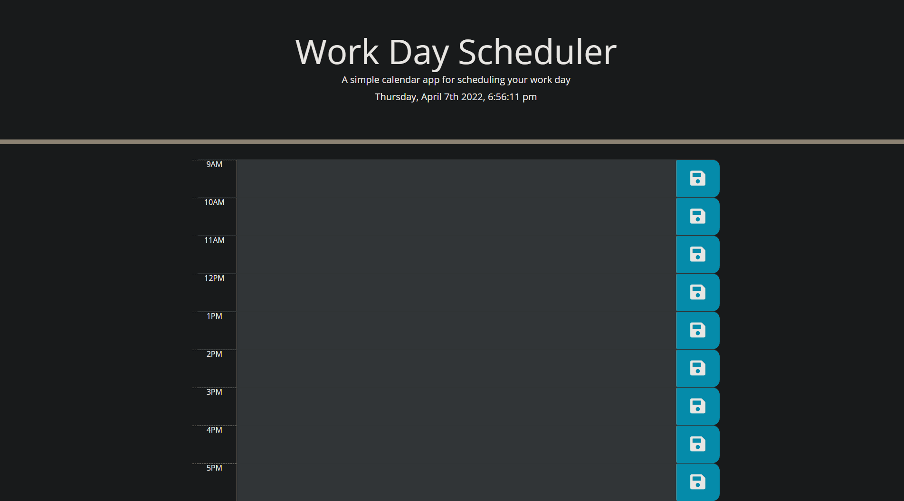

# work-day-scheduler
# Work Day Scheduler homework for UCF

# Maintained By:
Austin Donovan

# Description
This is a daily calandar build in javascript that utilizes jquery and moment.js API to display a different color in the input box relative to the time of day. the user inputs are also stored in local storage with an on click event listener applied to the save button.

# Contact Information:
Email: AustinLDonovan@gmail.com

Github: https://github.com/AustinLD

# Project Location:
[Github Repository](https://github.com/AustinLD/work-day-scheduler)

[Github Live Link](https://austinld.github.io/work-day-scheduler/)

# Project Example:
